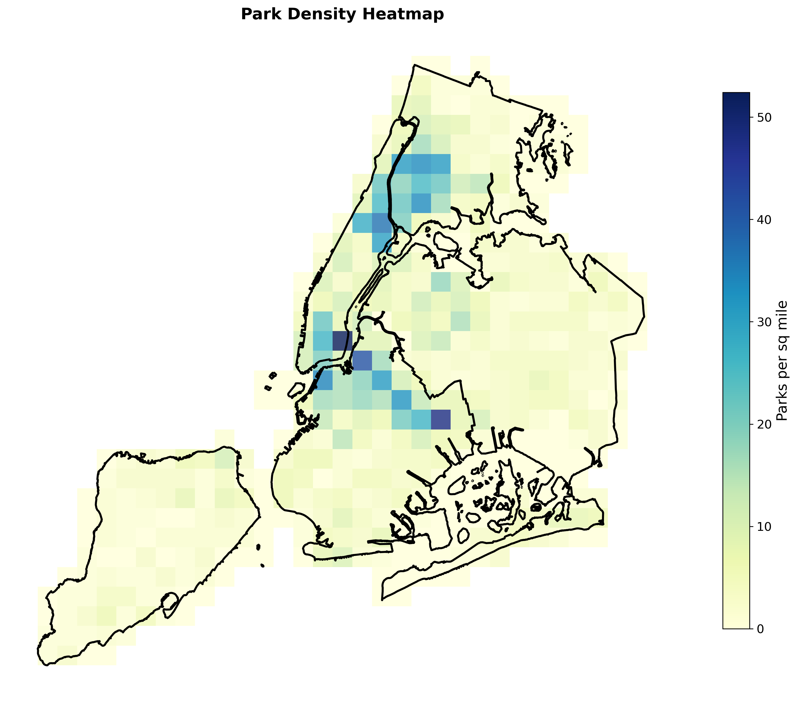
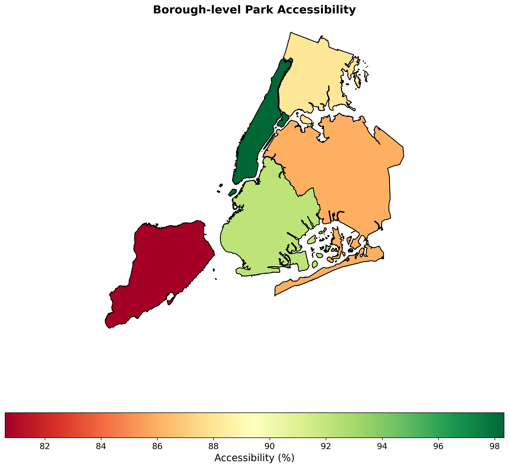
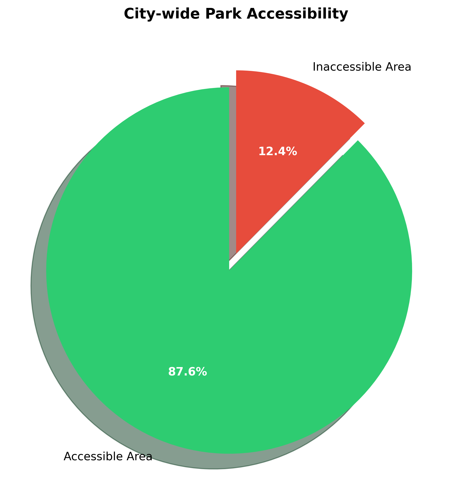
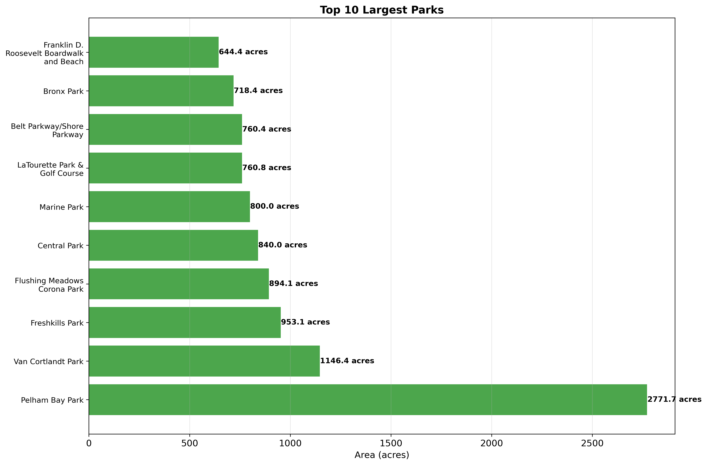

# NYC Urban Green Space Accessibility Analysis


## Project Overview

A comprehensive geospatial analysis evaluating public park accessibility across New York City using a 0.5-mile walking distance threshold. This project identifies areas with limited park access and provides data-driven recommendations for urban planning interventions.

## Key Findings

- **87.6%** of NYC's area has park access within walking distance
- **12.4%** (37.5 sq miles) lacks adequate park access
- **Manhattan** shows highest accessibility (98.3%)
- **Staten Island** shows lowest accessibility (80.6%)
- **2,054** public parks analyzed totaling **30,488 acres**

## 📊 Visualizations

### Main Accessibility Analysis

*Parks and 0.5-mile walking distance buffers across NYC*

### Park Density Distribution

*Spatial distribution of park density across the city*

### Areas Without Access

*Areas lacking park access within walking distance*

### Borough-level Performance

*Accessibility percentages by borough*

### Accessibility Breakdown

*City-wide accessible vs inaccessible areas*

### Largest Green Spaces

*Largest parks by acreage in NYC*

## Project Structure
nyc-park-accessibility/
│
├── data/ # Raw data files (not included in repo)
├── nyc_park_analysis_output/ # Generated outputs
│ ├── nyc_park_accessibility_composite.png
│ ├── 01_accessibility_map.png
│ ├── 02_park_density_heatmap.png
│ ├── 03_inaccessibility_analysis.png
│ ├── 04_borough_accessibility.png
│ ├── 05_park_size_distribution.png
│ ├── 06_accessibility_pie_chart.png
│ ├── 07_top_10_parks.png
│ └── nyc_park_accessibility_analysis.csv
│
├── notebooks/ # Jupyter notebooks
├── docs/ # Documentation
├── .gitignore # Git ignore rules
├── requirements.txt # Python dependencies
└── README.md # Project documentation

text

## Data Sources

1. **NYC Borough Boundaries**: NYC Department of City Planning
2. **Parks Properties**: NYC OpenData - Parks Properties
3. **Population Data**: NYC Neighborhood Tabulation Areas

## Installation & Setup

### Prerequisites
- Python 3.8+
- Jupyter Notebook
- GeoPandas and spatial dependencies

### Installation
```bash
# Clone repository
git clone https://github.com/zafariabbas68/NYC-Urban-Green-Space-Accessibility-Analysis.git
cd NYC-Urban-Green-Space-Accessibility-Analysis

# Create virtual environment
python -m venv venv
source venv/bin/activate  # On Windows: venv\Scripts\activate

# Install dependencies
pip install -r requirements.txt
Required Python Packages

python
geopandas>=0.12.0
pandas>=1.5.0
matplotlib>=3.6.0
contextily>=1.3.0
numpy>=1.23.0
shapely>=2.0.0
openpyxl>=3.0.0
Methodology

Spatial Analysis

Coordinate System: EPSG:2263 (NY State Plane Feet)
Buffer Distance: 2,640 feet (0.5 miles)
Accessibility Calculation: Spatial intersection analysis
Density Analysis: Grid-based heatmap generation
Analytical Approach

Data loading and preprocessing
Coordinate system standardization (EPSG:2263)
Park buffer creation (0.5-mile walking distance)
Accessibility calculation
Borough-level analysis
Visualization generation
Report compilation
Key Statistics

Metric	Value
Total City Area	302.1 sq miles
Accessible Area	264.6 sq miles
Inaccessible Area	37.5 sq miles
Accessibility Rate	87.6%
Total Parks	2,054
Total Park Area	30,488 acres
Average Park Size	14.8 acres
Borough-level Analysis

Borough	Area (sq mi)	Accessible Area (sq mi)	Accessibility (%)	Number of Parks	Park Density (parks/sq mi)
Manhattan	22.84	22.45	98.33%	391	17.12
Brooklyn	69.39	63.98	92.20%	614	8.85
Bronx	42.58	37.51	88.07%	391	9.18
Queens	109.10	93.77	85.95%	466	4.27
Staten Island	58.24	46.93	80.58%	153	2.63
Critical Insights

Strengths

High Overall Accessibility: 87.6% city-wide coverage demonstrates NYC's strong park infrastructure
Manhattan Excellence: Near-universal park access (98.3%) in the most densely populated borough
Substantial Park Inventory: 2,054 parks providing 30,488 acres of green space
Challenges

Geographic Disparities: Staten Island has significantly lower accessibility (80.6%)
Access Gaps: 37.5 square miles without park access within walking distance
Density Variations: Park distribution uneven across boroughs
Recommendations

Immediate Priorities

Targeted Development: Focus on the 12.4% of NYC without park access, particularly in low-accessibility areas
Pocket Parks: Implement small-scale green spaces in high-density, underserved neighborhoods
Pedestrian Infrastructure: Improve walking routes and connectivity to existing parks
Strategic Initiatives

Borough Equity: Prioritize park development in Staten Island and other lower-accessibility areas
Size Diversity: Ensure mix of large destination parks and neighborhood pocket parks
Community Engagement: Involve local residents in park planning and design processes
Long-term Planning

Climate Resilience: Integrate green infrastructure with park development
Health Equity: Align park access with public health objectives
Transit Integration: Coordinate park development with public transportation networks
Applications

This analysis supports:

Urban planning decisions
Park development prioritization
Environmental justice initiatives
Public health planning
Community development programs
Limitations

Walking Distance Assumption: 0.5-mile threshold may not suit all populations
Park Quality: Analysis considers access but not park quality or amenities
Population Distribution: Borough-level data rather than neighborhood-level
Temporal Factors: Analysis represents a snapshot in time
Future Enhancements

Potential improvements include:

Neighborhood-level population data
Park quality and amenity analysis
Seasonal accessibility variations
Public transportation integration
Environmental justice indicators
Contributing

Contributions to this project are welcome. Please ensure:

Code follows PEP8 guidelines
New features include appropriate tests
Documentation is updated accordingly
Spatial data sources are properly cited
License

This project is licensed under the MIT License - see the LICENSE file for details.

Citation

If you use this analysis in your work, please cite:

text
NYC Urban Green Space Accessibility Analysis. (2024). GitHub repository. 
https://github.com/zafariabbas68/NYC-Urban-Green-Space-Accessibility-Analysis
Contact

For questions about this project:

Email: ghulamabbas.zafari@gmail.com
GitHub: zafariabbas68
Acknowledgments

NYC Department of City Planning for boundary data
NYC OpenData for parks information
Open-source geospatial Python community
This project demonstrates the power of geospatial analysis in informing urban planning decisions and promoting equitable access to public amenities.
